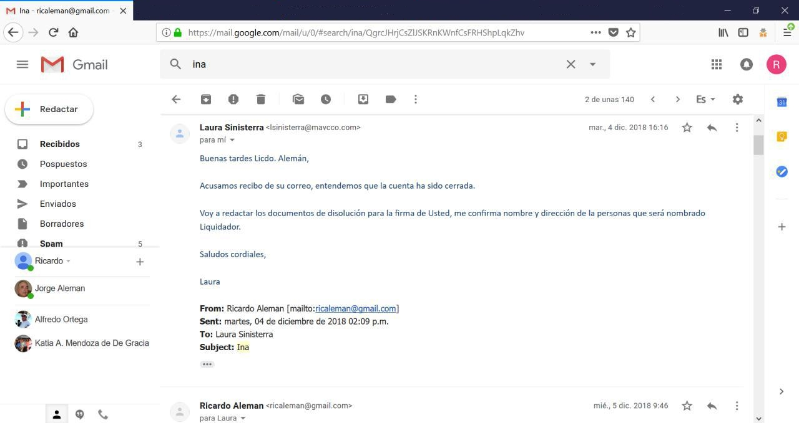

[Marzo 2019](http://inapapers.org)&nbsp;&nbsp;&nbsp;&nbsp;[INICIO](http://inapapers.org/index.html)&nbsp;&nbsp;&nbsp;&nbsp;[GALERIA](http://inapapers.org/galeria.html)

# BORRANDO LAS 
# EVIDENCIAS

***La apresurada decisión de Edwin Moreno por disolver INA INVESTMENT CORP.***

**Edwin Moreno Garcés, hermano del Presidente del Ecuador Lenin Moreno Garcés**, constituyó la firma fantasma **INA INVESTMENT CORP** en la ciudad de Belice en marzo de 2012.

Desde la fecha de su constitución hasta 2015, operó activamente con **Edwin Moreno Garcés** como titular de la firma, sin embargo en marzo de 2016, Moreno solicita explícitamente **"realizar los cambios para que mi nombre no aparezca en la sociedad " INA INVESTMENT y FUNDACION AMORE.**

Como podrá apreciarse en la comunicación epistolar electrónica mantenida entre el representante de los intereses de los **Moreno-Macía**s en **Panamá** y **Belice, Ricardo Alemán Alfaro** quien fuera ex embajador de Panamá en México y miembro del estudio jurídico panameño **Morgan & Morgan**, el 21 de marzo del 2016 la sociedad se disuelve jurídicamente en Belice, no obstante en mayo del mismo año la sociedad vuelve a aparecer con el nombre **INA INVESTMENT CORPORATION** en la ciudad de Panamá; en esta ocasión con **Ricardo Alemán Alfaro** y su esposa **Vivianes De Janon de Alemán** como accionistas pero facilitándole a la esposa de **Xavier Macías, María Patiño Herdoiza** con Poder General para que firme **"cualquier documento o escrituras que sean necesarios para la formalización de la compra del referido bien inmueble y en especial para formalizar, gestionar, tramitar y presentar declaraciones de inversiones extranjeras sobre bienes inmuebles y muebles".**

Aquí se aprecia también que hay una transferencia de **19.342 dólares** para la compra de **muebles en Moinat S.A., Antiquities en Suiza** que luego fueran trasladados al apartamento en el que entonces la familia presidencial residía, esto fue producto de controversia en los medios ya que cuando trascendió, el descargo oficial fue que la empresa **INA INVESTMENT CORP** encargada de la compra de los muebles pertenecía al empresario **Xavier Macías** cuando por el contrario los documentos evidencian que pertenecía al **hermano del Presidente Lenin Moreno, Edwin Moreno Garcés.**

Finalmente y tratando de eliminar todo tipo de rastros que condujeran a la familia Moreno, el ex embajador de Panamá en México solicita a **Laura Sinisterra de la firma de abogados Mendoza, Arias, Valle & Castillo (MAVCCO)** en Panamá que proceda a la inmediata disolución de **INA INVESTMENT CORPORATION**, sin embargo las huellas ya estaban impresas.

### **There are a lot of images in this article, [see more.](borrando-la-evidencia-photo.md)**
