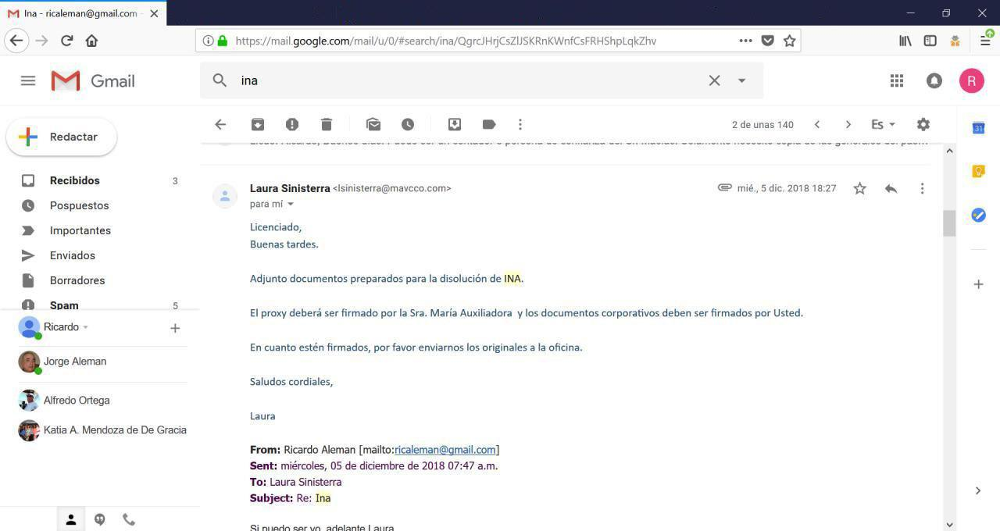

[Marzo 2019](http://inapapers.org)&nbsp;&nbsp;&nbsp;&nbsp;[INICIO](http://inapapers.org/index.html)&nbsp;&nbsp;&nbsp;&nbsp;[GALERIA](http://inapapers.org/galeria.html)

# INA MAILS

***(Más de 200 mil correos electrónicos que develan el entramado del poder y la corrupción.)***

En esta sección se encuentran los más de 200 mil correos pertenecientes a los respaldos de las cuentas de correos electrónico
##Descargar los Correos Electronicos de:
1. - [Lenin Moreno](http://inapapers.org/Correos/Lenin%20Moreno)
2. - [Rocío González de Moreno](http://inapapers.org/Correos/Rocio%20Gonzalez)
3. - [Ricardo Alemán](http://inapapers.org/Correos/Ricardo%20Aleman)
4. - [Guisella González](http://inapapers.org/Correos/Guisella%20Gonzalez)

En este material el lector podrá encontrar como se constituyó una **organización delictiva** que traficó influencias con **SINOHYDRO** en Ecuador, Panamá y Cuba para la concesión de obras públicas; como el **Presidente Lenin Moreno** reclama a los empresarios que realicen los aportes en efectivo y "que no sean sinvergüenzas" así como sus reacciones ante "atrasos" en "comisiones".

También se podrá apreciar la forma en que se adquirieron bienes por medio de estas empresas fantasmas y hasta se pagaban gastos personales por medio de empresas como **RECORSA** a la **Primera Dama Rocío González de Moreno**, pasando por la constitución y la disolución de sociedades para ocultar rastros en un entramado que nos retrotrae a las oscuras épocas del banquero italiano Roberto Calvi

En fin, ver con propios ojos las pruebas en cientos de miles de mensajes que dejan al desnudo el mecanismo de la corrupción y el entramado de redes de lavado de dinero que impacta de lleno al presidente ecuatoriano Lenin Moreno y su entorno más cercano, personal y de negocios.

