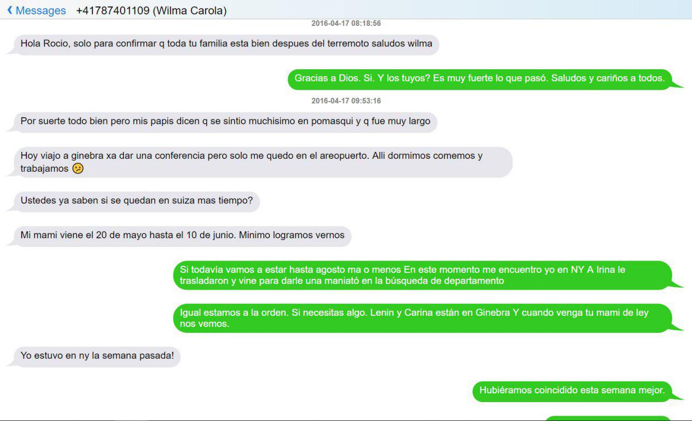

[Marzo 2019](http://inapapers.org)&nbsp;&nbsp;&nbsp;&nbsp;[INICIO](http://inapapers.org/index.html)&nbsp;&nbsp;&nbsp;&nbsp;[GALERIA](http://inapapers.org/galeria.html)

# INA PHONES

***Las comunicaciones que revelan la compra del departamento y mucho más.***

En esta sección se encontrarán dos respaldos completos de los iPhone y iPad del Presidente Lenin Moreno y de la Primera Dama Rocío González donde queda en evidencia entre chats y fotos, no solo la ostentación de la que los Moreno hacían, sino el lujo en el que vivían, viajando por todo el mundo, comprando vestimentas, camisas, corbatas, carteras, correas, relojes y joyas de marcas internacionales, pagando miles de dólares por cenas familiares en hoteles de lujos exclusivos y además quedando en evidencia que el Presidente sí estaba al tanto de todo con respecto a sus negociados con Macías a quien se lo puede ver inseparable de la familia moreno en todas las fotos y donde además se confirma en chats como los que se pueden apreciar en las siguientes imágenes que el departamento que adquirieron por debajo del valor de plaza en Alicante, España a la irrisoria cifra de 135 mil euros de manos de su amigo Emilio Torres Copado efectivamente estaba en conocimiento tanto de Lenin Moreno como de Rocío Gonzalez y familiares, contradiciendo de esta forma sus dichos públicos.

1. - [RESPALDO IPHONE LENIN MORENO](http://inapapers.org/iPhone-Lenin)
2. - [RESPALDO IPHONE ROCIO GONZALEZ](http://inapapers.org/iPhone-Rocio)

