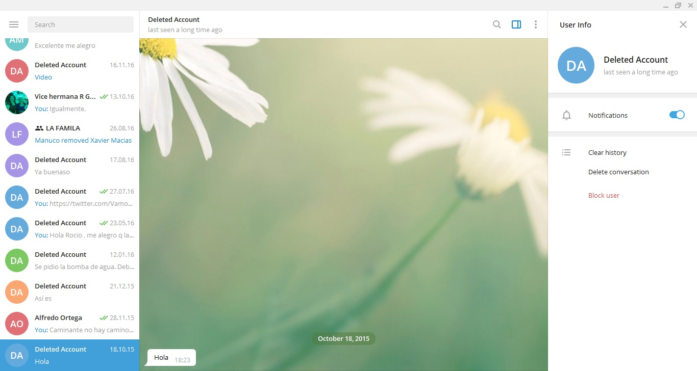

[Marzo 2019](http://inapapers.org)&nbsp;&nbsp;&nbsp;&nbsp;[INICIO](http://inapapers.org/index.html)&nbsp;&nbsp;&nbsp;&nbsp;[GALERIA](http://inapapers.org/galeria.html)

# LOS INA
# TELEGRAMS

***Los mensajes de Telegram que comprometen gravemente al Presidente Lenin Moreno.***

Este equipo de investigación logró hacerse con una copia completa de los mensajes de Telegram en su versión de escritorio (Desktop Version), alrededor de un millar. En ellos se puede apreciar infinidades de situaciones en donde el delito es tema de trato cotidiano; donde se pueden ver los arreglos tras bambalinas de los contratos y adjudicaciones a dedo para los amigos del Presidente a cambio de cierta **"comisión"**, los porcentajes que determinadas aseguradoras vinculadas al lobista **Xavier Macías Carmignani** le darán para **"repartir"**; así como también operaciones financieras y arreglos políticos que harían morir de vergüenza hasta al mismísimo Nicolás Maquiavelo.

Para que el lector se enfoque en como el Presidente y su entorno de negocios se manejan por fuera de lo institucional arreglando porcentajes y cerrando negocios, solo subiremos algunas capturas de particular relevancia (mientras que una copia original del sistema encriptado se ha entregado en la justicia en la que estos mensajes no pueden ser adulterados) en donde se puede ver a un Presidente ordenar que **"SINOHYDRO DEBE DAR EFECTIVO, NO SEAN SINVERGUENZAS", hasta una María Patiño (Esposa del testaferro Xavier Macías) que le dice a la actual Primera Dama: "Hola Rocío, me enviaron una cajita con 100 higos"** en referencia a **100 mil dólares que Rocío Gonzalez** recibió durante las navidades y que solicitara a su hermana **Guisella Gonzalez** que se los alcanzara.

Este compendio de mensajes le permitirá al lector imbuirse de lleno en el contexto y las situaciones en las que los personajes llevaban a cabo sus fechorías con total impunidad.

A continuación la galería de imágenes de capturas de los chats de Telegram.

There are a lot of images in this article, [see more](ina-telegrams-img.md)ina-telegrams