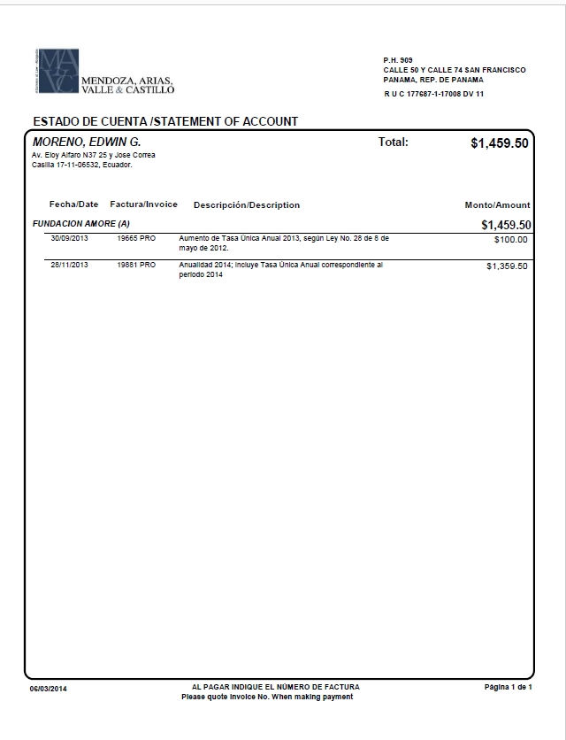
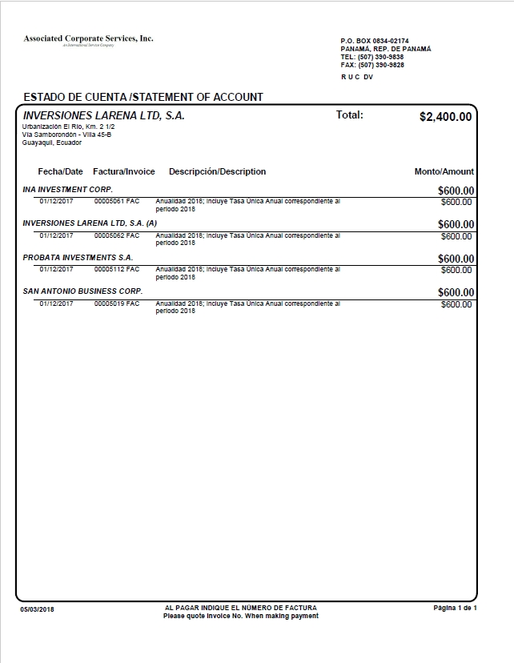
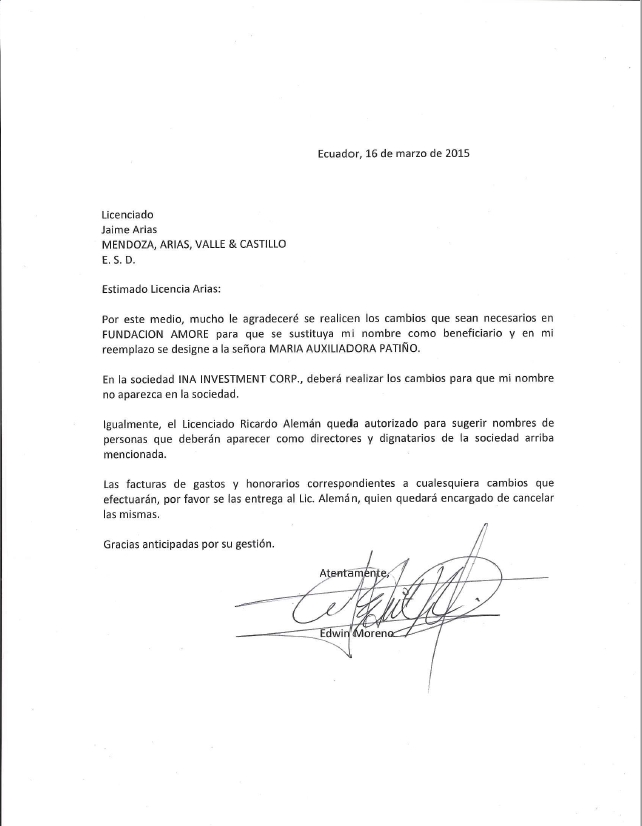
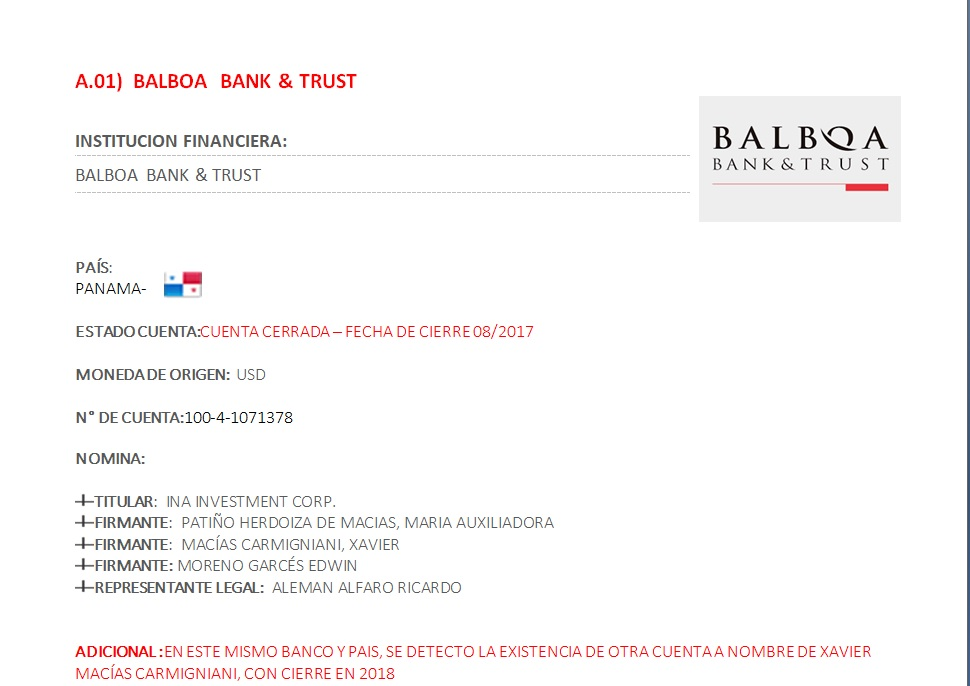

[Marzo 2019](http://inapapers.org)&nbsp;&nbsp;&nbsp;&nbsp;[INICIO](http://inapapers.org/index.html)&nbsp;&nbsp;&nbsp;&nbsp;[GALERIA](http://inapapers.org/galeria.html)

# INA INVESTMENT 
# CORP

***La empresa offshore que la familia presidencial utilizó para lavar dinero.***

En marzo de 2012, en la ciudad de Belice, el hermano del **Presidente del Ecuador Lenin Moreno, Edwin Moreno Garcés**, constituyó una empresa fantasma en la ex colonia británica bajo el nombre de **INA INVESTMENT CORP**, para el cual se ***"inspiró"*** no en el acrónimo ni de su esposa ni de sus padres ni de sus hijos, sino ni más ni menos que en el de sus sobrinas, las tres hijas del Presidente Lenin Moreno: Ir**INA**, Car**INA** y Crist**INA**; nombre que aunque el Presidente niegue vinculo alguno, son las mismas **iniciales que utiliza como clave tanto para su red wifi como para sus correos electrónicos** como se podrá apreciar en la sección **INA MAILS** en la que están disponibles para descargar los contenidos de las cuentas de los principales involucrados en esta trama de corrupción, lavado de activos y un complicado entramado de empresas fantasmas.

La empresa offshore **INA INVESTMENT CORP** por la que circuló dinero provenientes de coimas producto de las comisiones que el íntimo amigo, socio y testaferro del Presidente ecuatoriano **Lenin Moreno, Xavier Macías Carmignani** recibió fruto de haber logrado por medio de las influencias del entonces Vicepresidente y posteriormente enviado especial del secretario general de las Naciones Unidas sobre Discapacidad y Accesibilidad el otorgamiento de concesiones y adjudicaciones a empresas como la china **SINOHYDRO** y la panameña **RECORSA**, es parte de una red de empresas también fantasmas (offshore) que conformaron y algunas continúan haciéndolo, una red de lavado de activos que sirvió para canalizar los dineros ilegales , la evasión fiscal y tributaria y la adquisición anónima de bienes.

En esta red de empresas fantasma también se encuentran las siguientes empresas: **ESPIRITU SANTO HOLDINGS, FUNDACION AMORE, FUNDACION ESMALAU, FUNDACION PACHA MAMA, INVERSIONES LARENA, INVERSIONES MASPAL, MANELA INVESTMENT CORP, PROBATA INVESTMENTS, SAN ANTONIO BUSINESS CORP, TURQUOISE HOLDINGS LTD, VALLEY VIEW BUSINESS CORP,** algunas de las cuales también como la primera de esta lista, se encontraron a nombre de **Edwin Moreno** así como también vinculadas las siguiente personas:

A) **Lenin Moreno Garcés**: Presidente de la República del Ecuador.

B) **Edwin Moreno Garcés**: (hermano del Presidente de la República)

C) **Rocío González**: Primera Dama del Ecuador, esposa de Lenin Moreno.

D) **Xavier Macías Carmignani**: Empresario, íntimo amigo, socio y testaferro del Lenin Moreno.

E) **María Patiño**: Esposa de Xavier Macías Carmignani y testaferro junto con su esposo de las empresas fantasmas que administraron los activos ilícitos.

F) **Ricardo Alemán Alfaro**: Ex embajador de Panamá en México, empresario y socio de la firma Morgan & Morgan. Socio de Xavier Macías y apoderado de algunas empresas.

G) **Guisella González**: Cuñada del Presidente Lenin Moreno, hermana de la Primera Dama Rocío González.

H) **Ricardo Conto Patiño**: Titular de la empresa RECORSA y cuñado de Xavier Macías.

