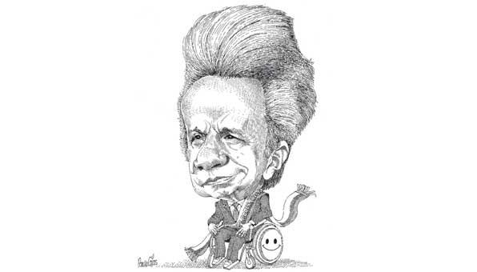

[Marzo 2019](http://inapapers.org)&nbsp;&nbsp;&nbsp;&nbsp;[INICIO](http://inapapers.org/index.html)&nbsp;&nbsp;&nbsp;&nbsp;[GALERIA](http://inapapers.org/galeria.html)

# INA PAPERS

***Los documentos sobre la corrupción presidencial en el Ecuador***

En **marzo de 2012**, en la capital de Belice, el hermano del **Presidente del Ecuador Lenin Moreno**, Edwin Moreno Garcés constituyó una empresa fantasma, comúnmente denominada offshore bajo el nombre **INA INVESTMENT CORP**. Su nombre no es una sigla ni nada por el estilo sino el acrónimo de las tres últimas letras de las tres hijas que el Presidente del Ecuador Lenin Moreno Garcés tuvo con su esposa Rocío González Navas: Ir**INA**, Car**INA** y Crist**INA**

La empresa fantasma de la que el Presidente dice no tener nada que ver pero que lleva implícito el nombre de sus tres hijas fue en primera instancia creada con el fin de recibir dineros que por medio del "empresario" y a la vez su testaferro **Xavier Macías Carmignani** se recaudaban producto de coimas que determinadas empresas como la china **SINOHYDRO** y la panameña **RECORSA**, pagaban por el lobby efectuado en las adjudicaciones de determinadas concesiones con el estado. En uno solo de esos movimientos se pagaron ni más ni menos que 18 millones de dólares.

## Que son los INA PAPERS?

Los **INA PAPERS** son una importante serie de documentos que confirman la existencia de una organización criminal liderada por el **Presidente del Ecuador Lenin Moreno Garcés** y que teniendo como integrantes de la misma a su señora esposa, la **Primera Dama Rocío González**, su íntimo amigo, el empresario y testaferro **Xavier Macías Carmignani**, la esposa de éste **María Herdoiza Patiño**, la cuñada del **Presidente Guisella González**, el hermano del Presidente, **Edwin Moreno Garcés** y el ex embajador de Panamá en México, **Ricardo Alemán Alfaro** junto a media docena de abogados y personajes secundarios, por medio de al menos una **docena de sociedades fantasmas (offshore)** constituidas en diversos paraísos fiscales han cometido una serie de delitos que incluyen el lavado de activos, la defraudación fiscal y tributaria, el tráfico de influencias y el cobro de coimas (cohecho) en perjuicio del estado ecuatoriano, cuyos alcances dado que se han cometido ilícitos en diferentes países ha derivado en lo que de acuerdo a los estándares manejados por INTERPOL en materia de lavado de activos categoriza como crimen transnacional.
Empresas fantasmas, delitos y vidas fastuosas.

Nombres pomposos como **ESPIRITU SANTO HOLDINGS, FUNDACION AMORE, FUNDACION ESMALAU, FUNDACION PACHA MAMA, INVERSIONES LARENA, INVERSIONES MASPAL, MANELA INVESTMENT CORP, PROBATA INVESTMENTS, SAN ANTONIO BUSINESS CORP, TURQUOISE HOLDINGS LTD, VALLEY VIEW BUSINESS CORP** junto con la infame **INA INVESTMENT CORP** son algunas de las empresas de fantasía que esta organización delictiva utilizó durante décadas para además de cometer todos los delitos previamente referidos, haber sido utilizadas como puente para la adquisición de bienes fastuosos como vehículos marca Ferrari, Carteras de cocodrilo, joyas, el pago de excéntricos viajes por el mundo y hasta la **adquisición por debajo del nivel de plaza inmobiliaria de departamentos en lujosos condominios en España**.

En este sitio proponemos al lector ya sea una simple persona ocasional o un periodista de investigación, vea y constate de primera mano las pruebas que abren las puertas de la corrupción presidencial en la República del Ecuador.

Links:

[INA Paper offcial website](http://inapapers.org)

[Mirror in github](https://github.com/offshoreleaks/ina_papers)
