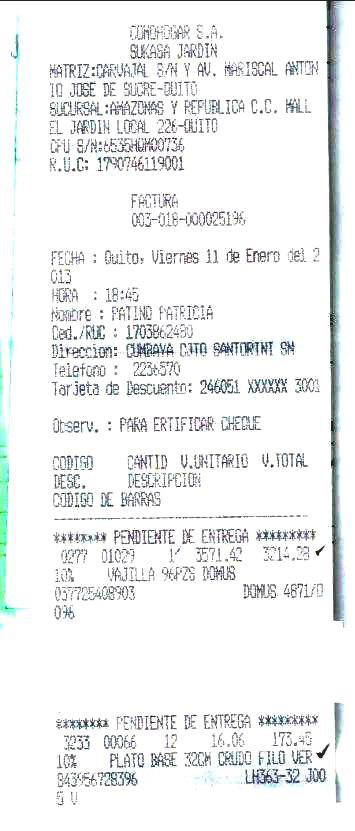
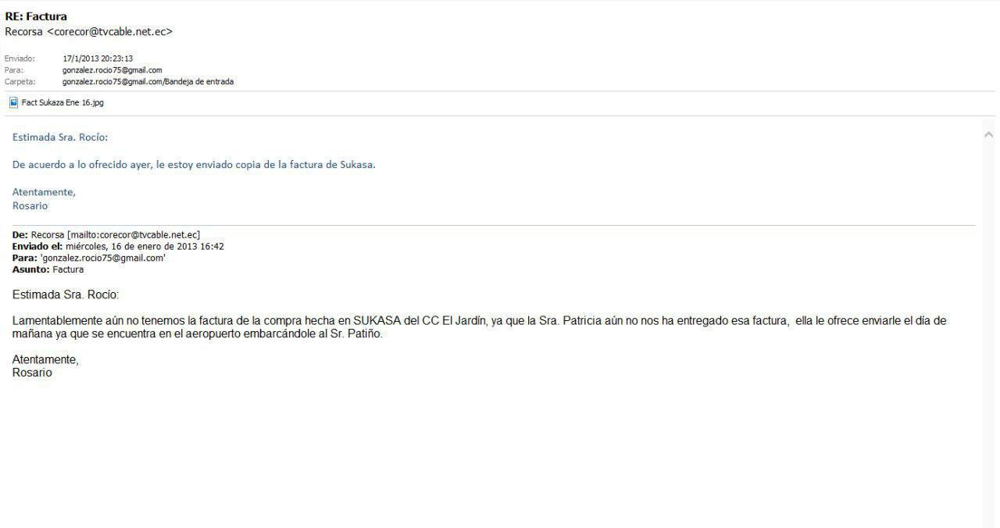

[Marzo 2019](http://inapapers.org)&nbsp;&nbsp;&nbsp;&nbsp;[INICIO](http://inapapers.org/index.html)&nbsp;&nbsp;&nbsp;&nbsp;[GALERIA](http://inapapers.org/galeria.html)

# RECORSA, CONTO
# PATIÑO Y LOS
# GASTOS DE LA
# PRIMERA DAMA

***De vajillas a muebles y de muebles a gastos hogareños pagos por empresas fantasmas***

Aunque se intente por todo tipo de artilugios mediáticos, desde prebendas y grandes pautas publicitarias a medios de comunicación hasta conferencias de prensa sin sentido, no hay otra verdad que la realidad decía un filósofo, en este caso la realidad que abunda son las pruebas que nuevamente **comprometen** sobremanera al **Presidente del Ecuador Lenin Moreno y su entorno** en hechos de corrupción y su vínculo con las empresas offshore que tanto se empecina en negar.

Una más vez el peso de la prueba y la evidencia y los rastros que a su paso va dejando por doquier nos reflejan la indiscutible relación entre el Presidente Lenin Moreno, su entorno familiar y de negocios y las empresas offshore.

En esta ocasión podemos ver como todo se conecta con todo en este entramado de corrupción y estos tickets evidencian como la empresa **RECORSA** de la que **Xavier Macías y Conto Patiño recibieron 18 millones de dólares**, es la encargada de **cubrir los gastos de la casa particular del Presidente Lenin Moreno**, en este caso como se puede apreciar claramente en el correo electrónico de la Primera Dama, a nombre de ella misma tercerizado por medio de **Patricia Patiño..**

