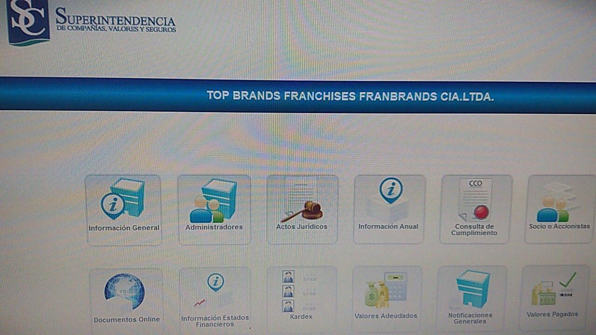
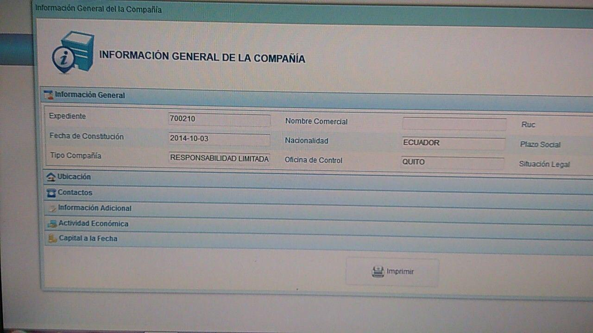

[Marzo 2019](http://inapapers.org)&nbsp;&nbsp;&nbsp;&nbsp;[INICIO](http://inapapers.org/index.html)&nbsp;&nbsp;&nbsp;&nbsp;[GALERIA](http://inapapers.org/galeria.html)

# TERRAFERISMO Y
# AMIGOS QUE SON
# MÁS QUE AMIGOS

***Me negarás tres veces, pero todos los caminos conducen a Lenin Moreno.***

Hasta el día de la fecha el Presidente del Ecuador Lenin Moreno Garcés solo ha salido a dar excusas y reaccionar de forma contestataria al igual que sus miembros del gabinete, pero no ha dicho ni una sola palabra al respecto de las personas con las que se las vincula y mucho menos ha detallado lo que se le pregunta, al contrario siempre envía a alguien a dar alguna vaga declaración o evade el tema con discursos cuánticos.

Por caso cuando surgió el affaire de los muebles en Ginebra por el que se pagaron cifras exorbitantes, Lenin Moreno solo dijo que pertenecían al empresario Xavier Macías Carmignani y que él solo se los almacenaba en su residencia; respecto de la vajilla de 4000 dólares pagada por RECORSA (la firma que recibió 18 millones de dólares de parte de SINOHYDRO como parte de coimas) no ha dicho nada, pero Conto Patiño es el yerno del testaferro de la familia Moreno, Xavier Macías. En relación al departamento en Villajoyosa, Alicante, España que en plaza del mercado inmobiliario actual cotiza más de 500 mil dólares y que pagara por 135 mil euros, no ha dicho nada al respecto de quien es el que tan generosamente le hiciera ese descuento de más de 350 mil dólares, al parecer el Presidente vive de las donaciones y la buena voluntad de sus amigos que todo le regalan.

Sin embargo esta investigación ha logrado llegar al fondo del asunto y ha descubierto que el ciudadano español Emilio Torres Copado junto con su esposa la ciudadana ecuatoriana nacionalizada española Soraya Leonor Salazar Chica, no solo son íntimos amigos del Presidente Lenin Moreno sino que incluso éste es socio de su yerno, el esposo de su hija Enrique Rodríguez Malo en una firma ecuatoriana llamada TOP BRANDS FRANCHISES FANBRANDS CIA.LTDA., como podrá apreciarse en el siguiente documento al que este equipo tuvo acceso.

Pero como si ello fuera poco y todavía el Presidente Lenin Moreno sigue sosteniendo en no reconocer los vínculos con Torres Copado, aquí les dejamos algunos registros fotográficos de TORRES COPADO y su esposa SORAYA SALAZAR en completa intimidad y de shopping por Europa y Ecuador con la Primera Dama Rocío González y el Presidente Lenin Moreno así como también una serie de intercambios de correos electrónicos donde demuestran la extrema cercanía de los TORRES COPADO con los MORENO, en uno de ellos incluso puede apreciarse la intención de inaugurar entre los MORENO y los TORRES un emprendimiento inmobiliario. Como dicen, una imagen vale más que mil palabras. 